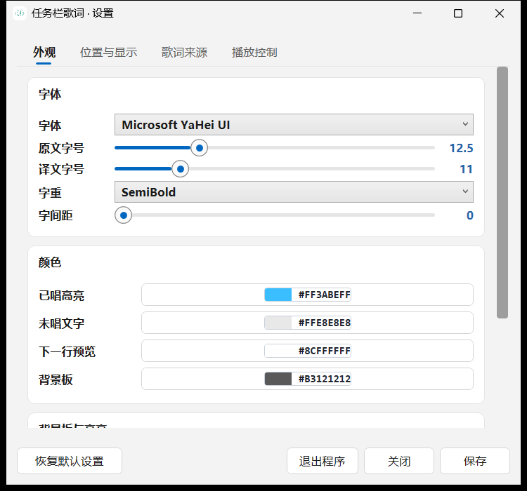

# TaskbarLyrics · QQ音乐任务栏歌词

[](https://github.com/DoingStone/DesktopMusic/actions/workflows/ci.yml)
[](LICENSE)

在 Windows 任务栏的空白区域（时钟左侧）实时显示 **QQ音乐** 当前播放的歌词：双行显示、逐字高亮、支持翻译、可拖动调整位置。

本项目为**自研实现**，零第三方依赖（只用 .NET 8 + WPF），歌词匹配与解析思路参考了 [TaskbarLyrics](https://github.com/ANYNC/TaskbarLyrics) 与 [Lyricify-Lyrics-Helper](https://github.com/WXRIW/Lyricify-Lyrics-Helper)。

---

## 效果

任务栏中的实际效果 —— 左侧为播放控制与歌曲进度，右侧为逐字高亮的歌词：


设置界面（Win11 设置页风格）：



任务栏中实时渲染当前歌词行，已唱部分按演唱进度用高亮色「刷」过去：

```
┌─ 任务栏 ─────────────────────────────────────────────────────────┐
│  ...   │  丢掉了画画和长发  │  🔊 🌐  14:32  2026/9/17  │
└──────────────────────────────────────────────────────────────────┘
   ↑ 青色 = 已唱部分（逐字推进）  白色 = 未唱部分
```

- **逐字高亮**：当前行按演唱进度逐字推进，而不是整行闪烁
- **歌曲进度**：播放按键下方显示进度条与 `当前时间 / 总时长`
- **翻译行**：有翻译时在原文下方联动显示
- **下一行预览**：提前显示即将演唱的歌词
- **点击穿透**：锁定状态下完全不挡任务栏操作
- **可拖动**：解锁后可直接拖到任意位置，位置自动记忆
- **超长行滚动**：文字宽度超出可用区域时改为跑马灯滚动，不会与播放按键重叠

---

## 快速开始

```powershell
# 一键构建并启动
powershell -ExecutionPolicy Bypass -File scripts\run-app.ps1
```

启动后：

| 操作 | 方式 |
| --- | --- |
| **打开设置界面** | **双击 exe 即会自动打开**；之后可用托盘右键 → **设置…**，或 `TaskbarLyrics.exe --settings` |
| 显示/隐藏歌词 | **双击**托盘图标（单击不响应，避免误触） |
| 移动位置 | 设置 → 取消「锁定位置」→ 直接拖动 → 再锁定；或用设置中的方向微调按钮 |
| 歌词偏移校准 | 设置 → 位置与显示 → 歌词同步微调 |
| **退出程序** | 设置窗口右下角 **退出程序**；或托盘右键 → **退出** |

启动参数：

| 参数 | 作用 |
| --- | --- |
| （无） | 显示歌词**并打开设置窗口**（双击 exe 的默认行为） |
| `--settings` | 强制打开设置窗口 |
| `--tray` / `--silent` | 只显示歌词、不打开任何窗口（适合开机自启） |
| `--selftest` | 运行设置读写自检并退出（返回码 0 表示通过） |

关闭 QQ音乐或暂停播放时，歌词会自动隐藏/冻结。

---

## 设置界面

双击 exe 自动打开，或托盘右键 → **设置…**。三个分页，**所有修改即时生效**
（任务栏歌词实时变化）。右下角三个按钮：

| 按钮 | 行为 |
| --- | --- |
| **保存** | 保存设置，窗口保持打开，可继续调整 |
| **关闭** | 收起窗口，**歌词继续显示**；改动会被保存，不会丢失 |
| **退出程序** | 二次确认后关闭歌词并退出 |

「恢复默认设置」在左下角，会重置所有外观/位置/来源设置（歌词缓存不受影响）。

| 分页 | 可调项 |
| --- | --- |
| **外观** | 字体、字重（Light/Normal/SemiBold/Bold）、原文字号、译文字号、**字间距**；已唱高亮色、未唱文字色、下一行预览色、背景板色（取色器 + 24 色色板，也支持手输 `#RRGGBB` / `#AARRGGBB`）；背景板开关与圆角；逐字高亮、翻译行、下一行预览开关 |
| **位置与显示** | **宽度、高度（0=自动）**、**垂直对齐、水平偏移、垂直偏移**、**整体不透明度 15%~100%**；四方向微调 + 恢复默认位置；锁定位置（点击穿透）、是否显示、暂停时是否显示、无歌词时是否隐藏；歌词偏移（−5000…+5000 毫秒） |
| **歌词来源** | QQ音乐 / 网易云音乐 / LRCLIB 启用开关；「重新匹配当前歌曲」「清空歌词缓存」；「查看当前歌词匹配详情」诊断弹窗 |
| **播放控制** | 上一首 / 暂停播放 / 下一首 三个按钮；四个**全局快捷键**（可自定义，留空即关闭） |

颜色会规范化为 `#AARRGGBB` 后写入配置。

> 调字体和颜色时请直接看任务栏——那才是最真实的预览。

### 拖动调整位置

在「位置与显示」里**取消勾选「锁定位置」**，就能直接用鼠标按住任务栏上的歌词框拖动。
松手后位置自动保存（按 DPI 正确换算）；重新勾选「锁定位置」恢复点击穿透，不会挡住任务栏操作。

### 播放控制

歌词框本身是**点击穿透**的——这是刻意的，否则它会吞掉任务栏上的点击。
因此播放控制没有做成悬浮窗上的按钮，而是提供两条途径：

1. **设置 → 播放控制**：三个按钮直接控制当前播放器。
2. **全局快捷键**（可在设置里改）：

| 功能 | 默认快捷键 |
| --- | --- |
| 暂停 / 播放 | `Ctrl+Alt+Space` |
| 下一首 | `Ctrl+Alt+Right` |
| 上一首 | `Ctrl+Alt+Left` |
| 显示 / 隐藏歌词 | `Ctrl+Alt+L` |

命令通过系统 SMTC 发送给「正在为歌词提供播放信息」的那个播放器。
若该播放器未开放相应控件（部分播放器不暴露「下一首」），界面会提示不支持而不是静默失败。
格式为 `修饰键+按键`，如 `Ctrl+Alt+Space`、`Ctrl+Shift+Right`、`Ctrl+Alt+P`。

---

## 环境要求

- Windows 10 / 11 x64
- **运行已发布的 exe**：需 [.NET 8 Desktop Runtime](https://dotnet.microsoft.com/download/dotnet/8.0)（目标机器没有就用 `-SelfContained` 发布免运行时版）
- **从源码构建**：需 .NET 8 SDK
- QQ音乐（其他播放器只要向系统上报媒体信息也能用）

无需安装 WebView2，无外部运行库。

---

## 构建与发布

```powershell
# 构建
dotnet build TaskbarLyrics.sln -c Release

# 发布为可分发文件夹 + ZIP（约 25 MB，ZIP 约 6 MB）
powershell -ExecutionPolicy Bypass -File scripts\publish.ps1

# 免 .NET 运行时的独立版（体积大得多）
powershell -ExecutionPolicy Bypass -File scripts\publish.ps1 -SelfContained
```

产物在 `publish\TaskbarLyrics\`，主程序 `TaskbarLyrics.exe`；
同目录的 `TaskbarLyrics.dll`、`Microsoft.Windows.SDK.NET.dll` 等必须与 exe 放在一起。

---

## 工程结构

```
src/
  TaskbarLyrics.Core/          歌词与播放状态引擎（无 UI 依赖）
    Media/
      SmtcMediaSessionSource.cs  Windows SMTC 读取播放状态
    Lyrics/
      LrcParser.cs               LRC / QRC 解析、翻译合并、元数据识别
      LyricMatcher.cs            候选歌词打分（标题/歌手/时长/版本冲突）
      LyricResolver.cs           多源并发检索与择优、缓存
      Providers/
        QqMusicProvider.cs       QQ音乐（搜索 + 歌词/翻译）
        NetEaseProvider.cs       网易云音乐
        LrclibProvider.cs        LRCLIB（开放数据库）
    Models/                      LyricDocument / LyricLine / PlaybackSnapshot
  TaskbarLyrics.App/           WPF 界面
    Views/OverlayWindow         任务栏悬浮窗
    Views/SettingsWindow        设置界面（三个分页，改动即时生效）
    Controls/KaraokeLine.cs     逐字高亮自绘控件
    Controls/ColorField.xaml    取色器（色板 + 十六进制输入）
    Platform/TaskbarLocator.cs  任务栏几何 + DPI 换算
    Interop/                    Win32 互操作（托盘、样式、透明模式）
  TaskbarLyrics.Cli/           命令行诊断工具（tblc，不随发布包分发）
scripts/                       启动与发布脚本
tools/                         排查脚本（DPI 截图、歌词 API 探针、设置联动测试等）
```

---

## 技术要点

### 1. 播放状态：Windows SMTC

不注入、不 Hook QQ音乐，直接读取系统媒体会话（`GlobalSystemMediaTransportControlsSession`），
也就是音量弹窗里那个「正在播放」信息：

| 字段 | 实测值 |
| --- | --- |
| SourceAppUserModelId | `QQMusic.exe` |
| Title / Artist / Album | 完整可用 |
| Position / EndTime | 可用，**每秒更新约 1 次** |

由于 SMTC 更新频率只有约 1Hz，渲染层用 `PlaybackSnapshot.ExtrapolatedPosition()`
按本机时钟外推播放进度，因此歌词滚动是平滑的而不是每秒跳一格。

### 2. 歌词来源：为什么必须用 `musicu` 接口

这是本项目最关键的一个发现：

| 接口 | 歌词 | 翻译 |
| --- | --- | --- |
| `c.y.qq.com/lyric/fcgi-bin/fcg_query_lyric_new.fcg` | ✅ | ❌ **恒为空** |
| `u.y.qq.com/cgi-bin/musicu.fcg` → `GetPlayLyricInfo` | ✅ | ✅ **无需登录即可取得** |

后者返回 base64 编码的 `lyric` 与 `trans`，解码后即是带时间轴的 LRC。
实测《Shape of You》可拿到 92 行原文 + 137 行翻译；未翻译的行以 `//` 占位，解析时会被丢弃。

三个来源并发检索，按「标题 55 / 歌手 30 / 时长 15」加权打分择优；
`Live`、`Remix`、`伴奏` 等版本差异会额外扣分，避免播录音室版却匹配到 Live 版歌词。

### 3. 逐字高亮

`KaraokeLine` 是自绘控件（`OnRender` + `FormattedText`）：同一行文字绘制两遍，
第二遍用「已唱宽度」的矩形裁剪。因为两遍使用完全相同的排版参数，字形宽度一致，
高亮边界会精确落在字符上。

- 有 QRC 逐字时间轴时 → 按真实音节边界推进
- 只有行级 LRC 时 → 按行内进度比例推进（中文歌词视觉上等价于逐字）

### 4. 两个必须处理的 Windows 坑

**(a) DPI 坐标换算**

Win32 返回的是**物理像素**，而 WPF 的 `Window.Left/Top/Width/Height` 是**设备无关像素（DIP）**。
本项目进程为 `SYSTEM_AWARE`，在 125% 缩放的显示器上，若直接把物理像素赋给 WPF，
窗口会偏移并拉伸（实测偏了 324px）。因此所有几何量都要除以 `DpiScale`
（取自 `VisualTreeHelper.GetDpi(window)`，与 WPF 自己的换算保持一致）。

排查脚本也必须在截图前调用 `SetProcessDpiAwarenessContext(PER_MONITOR_AWARE_V2)`，
否则截到的是被虚拟化的坐标区域——**这正是本次开发中最耗时的一个陷阱**：
截图看起来「窗口没渲染」，实际是截图取错了区域（虚拟化后 2048×1152，
真实为 2560×1440）。`tools/capture-dpi-aware.ps1` 已处理这一点。

**(b) 透明合成模式**

默认使用 WPF 逐像素透明（`AllowsTransparency`，画质最好：文字抗锯齿、背景半透明）。
个别环境下这种分层窗口可能只栅格化却不合成到屏幕，表现为「日志一切正常但屏幕上看不见」。

`TransparencyMode.VerifyPerPixelAlpha()` 会在启动时做一次**实证检测**：
临时隐藏内容树、把窗口涂成洋红哨兵色（隐藏内容是为了避免半透明背景掩盖检测色），
等合成器稳定后**直接读屏幕上那一个像素**，颜色对不上就自动退回
「不透明窗口 + `LWA_COLORKEY` + `SetWindowRgn` 圆角」方案。

> 调试提示：该检测本身也曾因用 `Window.Left/Top`（DIP）而非窗口真实设备像素矩形
> 计算采样点而误报失败，导致自动降级到色键模式。修复后正常保留逐像素透明。

两种模式都可用环境变量强制指定：

```powershell
$env:TBL_COMPOSITE = 'alpha'     # 强制逐像素透明
$env:TBL_COMPOSITE = 'colorkey'  # 强制色键方案
```

---

## 设置

配置文件：`%APPDATA%\TaskbarLyrics\settings.json`（首次修改后生成；托盘菜单可打开）。

常用项：

| 键 | 说明 | 默认 |
| --- | --- | --- |
| `Width` | 悬浮窗宽度（DIP） | `460` |
| `OffsetX` / `OffsetY` | 相对默认锚点的偏移，拖动即改 | `0` |
| `FontFamily` | 字体 | `Microsoft YaHei UI` |
| `OriginalFontSize` / `TranslationFontSize` | 原文/译文字号 | `12.5` / `11` |
| `HighlightColor` | 已唱高亮色 | `#FF3ABEFF` |
| `BaseColor` | 未唱文字色 | `#FFE8E8E8` |
| `ContextColor` | 下一行颜色 | `#8CFFFFFF` |
| `BackgroundColor` | 背景板颜色（含透明度） | `#B3121212` |
| `ShowTranslation` | 显示翻译行 | `true` |
| `ShowContextLines` | 显示下一行预览 | `true` |
| `EnableWordHighlight` | 逐字高亮 | `true` |
| `GlobalOffsetMs` | 全局歌词偏移（毫秒，正数延后） | `0` |
| `Locked` | 锁定位置（点击穿透） | `true` |
| `EnableQqMusic` / `EnableNetEase` / `EnableLrclib` | 启用歌词源 | 全开 |

> 注：`BackgroundColor` 同时是背景板填充色与 `colorkey` 模式下的面板色，
> 修改后重新匹配/重启生效。

---

## 命令行诊断

`TaskbarLyrics.Cli` 输出为 `tblc.exe`，不依赖 UI，用来定位问题：

```powershell
$exe = "src\TaskbarLyrics.Cli\bin\Release\net8.0-windows10.0.19041.0\tblc.exe"

& $exe selftest   # 22 项解析/匹配/外推单元校验
& $exe now        # 打印当前曲目、各歌词源命中情况、当前歌词窗口
& $exe watch      # 持续滚动当前歌词（类似任务栏效果）
```

设置读写校验在 App 内（走真实的产品代码路径；WinExe 无控制台，结果同时写入
`%TEMP%\taskbar-lyrics-selftest.txt`）：

```powershell
& "src\TaskbarLyrics.App\bin\Release\net8.0-windows10.0.19041.0\TaskbarLyrics.exe" --selftest
echo $LASTEXITCODE   # 0 = 全部通过
```

完整验收（构建产物 + 单元校验 + SMTC 实读 + 歌词解析 + 叠加窗真机像素 + 设置持久化）：

```powershell
powershell -ExecutionPolicy Bypass -File tools\acceptance.ps1
```

`now` 的输出示例：

```
=== Track (SMTC) ===
  source   : QQMusic.exe
  title    : 河流 (Live)      artist : 川川南
  duration : 00:05:20.61      position : 00:04:12.01

=== Provider traces (830 ms) ===
  网易云音乐   candidates=10  best= 100.0  有结果  「河流 (Live)」 - 川川南
  QQ音乐      candidates=10  best=  99.7  有结果  「河流 (Live)」 - 川川南
  LRCLIB     candidates=0   best=   0.0  无结果

=== Resolved === source=NetEase score=100.0 lines=46
```

---

## 验证状态

在 Windows 11 (26200) / 2560×1440 @125% / .NET 8 上，`tools\acceptance.ps1` **19/19 全部通过**：

| 项目 | 结果 |
| --- | --- |
| 构建产物 | app / cli 均生成 |
| 引擎单元校验 | 22 passed, 0 failed |
| SMTC 实读 | `QQMusic.exe` 曲目/歌手/时长/进度全部可用 |
| 歌词解析 | 41 行，匹配分 99.8（QQ音乐源） |
| 叠加窗真机像素 | 位置 `(1622,1381)-(2197,1439)`，145 种颜色，高亮色 `#3ABEFF` 存在 |
| 设置持久化 | 12 passed, 0 failed |

> 说明：`abs` 值的差异来自 125% 缩放——Win32 报 2560×1440 物理像素，
> 未声明 DPI 感知的工具会看到 2048×1152 的虚拟化坐标。

---

## 故障排查

| 现象 | 处理 |
| --- | --- |
| 任务栏看不到歌词 | 托盘右键 → 确认「显示任务栏歌词」为勾选；再试「重新匹配当前歌曲歌词」 |
| 歌词不同步 | 托盘 → 调整歌词偏移；或在设置里改 `GlobalOffsetMs` |
| 匹配到错误版本（如 Live） | 设置里调整偏移无效时，用 `tblc now` 看各源命中；必要时清缓存后重试 |
| 界面完全不见但进程在跑 | `scripts\run-app.ps1 -Diag`，查看 `%TEMP%\taskbar-lyrics-diag.log`；强制 `-Composite colorkey` |
| 任务栏是浅色导致文字发灰 | 调大 `BackgroundColor` 的 alpha（如 `#CC121212`） |
| 播放器不支持 | 该播放器需向系统上报媒体信息；用 `tblc now` 看 `source` 是否出现 |

`tools/` 下的脚本用于复现显示问题：

```powershell
# DPI 感知截图 + 叠加窗口像素统计
powershell -ExecutionPolicy Bypass -File tools\capture-dpi-aware.ps1
# 叠加窗口 z-order 与真实屏幕像素
powershell -ExecutionPolicy Bypass -File tools\zorder-diag.ps1 -Mode alpha
# 两种透明模式对比
powershell -ExecutionPolicy Bypass -File tools\test-modes.ps1 -Mode colorkey
# 歌词接口探针（原文/翻译/逐字）
powershell -ExecutionPolicy Bypass -File tools\qq-musicu-lyric.ps1
```

---

## 已知限制

- **QRC 逐字时间轴**：QQ音乐的 `format=qrc` 返回加密数据，本项目未做解密，
  因此逐字高亮目前是按行内比例推进的（视觉上已接近逐字，但并非真实音节时间）。
- **翻译覆盖率**：取决于歌曲本身；中文歌多数无翻译，欧美歌曲覆盖较好。
- **多显示器**：当前只在**主显示器**任务栏显示。
- **本地歌词**：暂不支持读取本地 `.lrc` / `.qrc` 文件。

---

## 致谢与许可

思路参考：

- [ANYNC/TaskbarLyrics](https://github.com/ANYNC/TaskbarLyrics) — MIT，任务栏歌词与 Windows 合成桥接方案
- [WXRIW/Lyricify-Lyrics-Helper](https://github.com/WXRIW/Lyricify-Lyrics-Helper) — 多平台歌词检索与解密
- [LRCLIB](https://lrclib.net) — 开放歌词数据库

本项目为独立实现，代码原创。歌词内容版权归各音乐平台与版权方所有，本工具仅用于本地播放时的辅助显示。

---

## 许可证

[MIT](LICENSE) © 2026 DoingStone

## 持续集成

GitHub Actions 在每次提交时执行（见 `.github/workflows/ci.yml`）：

1. `dotnet build -c Release`
2. 引擎自检 `tblc selftest`（歌词解析、版本匹配、URI 构建、人声时长、位置外推）
3. 设置自检 `TaskbarLyrics.exe --selftest`（设置持久化 + 色板离屏渲染）
4. `dotnet publish` 验证打包，并上传构建产物
